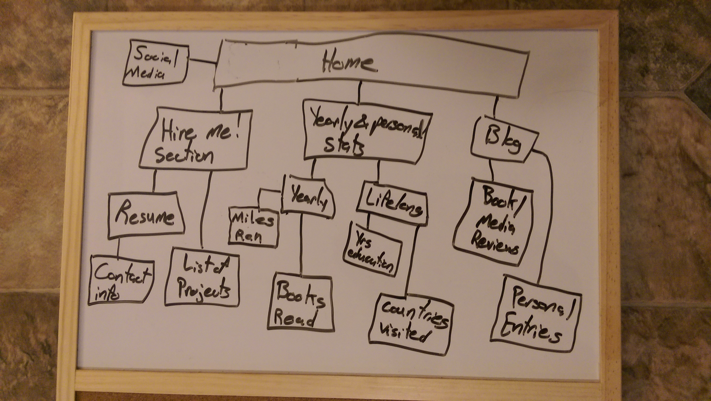

The six phases of web design (with applications) are:
1. Information Gathering
* Understanding the purpose, goals, target audience, and content on the site.
* I have two audiences, my future employers, and my friends/family/peers/curious strangers. I will make it easy for the form to go to to a prominent "hire me!" section containing my resume and a list of projects. I want the other half of the site to chronicle my life in a quantitative and qualitative way. Qualitative through a blog and book/movie/music reviews, and quantitative through an updated list of non-professional accomplishments by the numbers. (e.g. Number of new books read this year, number of countries I've visited in my life).
2. Planning
* Drawing and redrawing a site map.
* User experience is how an end user feels when navigating a system like my website. Good user experience design would mean my user feels the operation of my site is simple, that the site seems useful, the operation is novel or fun in some way, and that it efficiently yields the information to each group of my audience. My site is comparatively simple, so good user experience won't be as difficult as a complex site with lots of systems, like amazon or wikipedia.
3. Design
* Creating a wireframe to map out things like headings, sidebars, and text blocks. Deciding on colors and fonts and pictures.
* User experience in planning also extends to design. An aggresively ugly website is not pleasureable to use.
* Design resources include [wireframe mockup sites](https://balsamiq.com/), many [color](https://color.adobe.com/create/color-wheel/) [comparison](http://paletton.com/#uid=32Z0+0kKYKYn1LUtBL7LesuMhm6) sites, [stock photos](http://bootstrapbay.com/blog/free-stock-photos/), and [font](https://www.google.com/fonts/) test sites.
4. Development
* Writing code for the site based on graphic prototype and site map.
5. Testing and Delivery
* Testing that forms or scripts work, it's viewable in different browsers (including old ones) and on mobile devices. Then the site is uploaded to the server.
6. Maintenance
* Updating information but also things like site backups, web platform upgrades, and additional plugin installation.