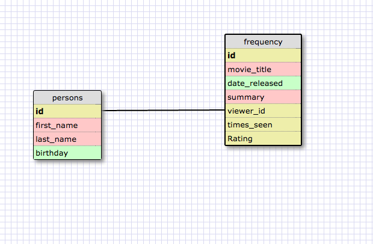
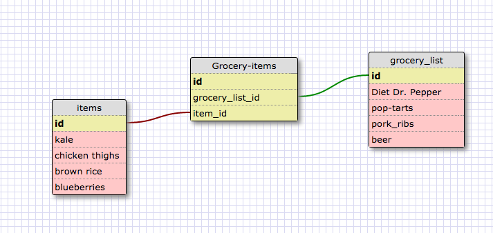

#8.5 More Schemas

___
### Release 2

After consideration, I decided to create a table of people's names, and a linked table of the number of times any person on the list has seen the movie *Star Wars Episode VII: The Force Awakens*. My reasoning is that each person can only have one single number of times they've seen the movie, and that number could be null.
___
### Release 4

___

### Reflection
**What is a one-to-one database?**
A database where one entity in table 1 is linked to (at least) one element in table 2, and vice versa.

**When would you use a one-to-one database? (Think generally, not in terms of the example you created).**
If I were modeling a relationship where an element on table 1 has at most one corresponding element linked to it on table 2. Ideally I would use one if a number of the entities on table 1 have a null relationship to the corresponding element on table 2. It's is more functional and DRYer than creating a table with an entire column populated mostly by NULLs.

**What is a many-to-many database?**
One that models a relationship between two entities in which entity 1 may have a part record for which there are many child records in entity 2, and vice versa. Distinctive because the two (or more) tables are linked by a join table that contains those tables' relevant foreign keys.

**When would you use a many-to-many database? (Think generally, not in terms of the example you created).**
If I were modelling a relationship where multiple actors are making multiple transactions or choices, but only a finite number.

**What is confusing about database schemas? What makes sense?**
It's difficult to think in the required level of abstraction to understandt the material and to not just think in terms of examples. I found that I went most astray when I was thinking of examples of relationships, instead of really concentrating on the conceptual reasoning behind database schemas. I worked extensively with relational databases at my first post-college job, so if anything I'm pleased with how much I've retained from that job.